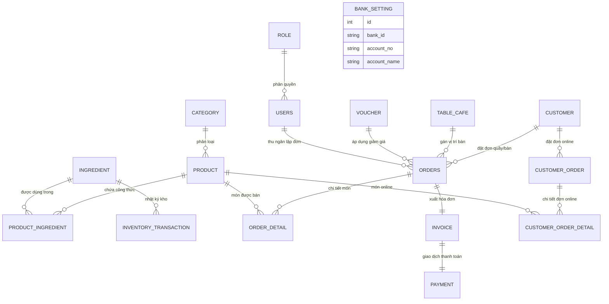

# TỔNG HỢP HỆ THỐNG SƠ ĐỒ UML & KIẾN TRÚC - CÔ ĐÀO QUÁN POS

Tài liệu này tổng hợp toàn bộ các sơ đồ phân tích thiết kế hệ thống (UML Diagrams) cần có cho báo cáo đồ án / luận văn của dự án **Cô Đào Quán POS**.

---

## I. DÁNH SÁCH CÁC SƠ ĐỒ CẦN VẼ (SUMMARY OF DIAGRAMS)

1. **Sơ đồ Use Case tổng thể (Use Case Diagram)**: Phân tích 3 nhóm tác nhân chính (Admin, Staff, Customer).
2. **Sơ đồ Thực thể Mối quan hệ (ERD - Entity Relationship Diagram)**: Mô tả 17 thực thể CSDL.
3. **Sơ đồ Tuần tự (Sequence Diagram)**: 
   - Luồng Bán Hàng Tại Quầy POS (POS Cashier Checkout).
   - Luồng Khách Đặt Món Online & Admin Duyệt Đơn.
   - Luồng Thanh Toán Qua Mã VietQR & In Hóa Đơn Nhiệt 80mm.
4. **Sơ đồ Lớp (Class Diagram)**: Mô tả kiến trúc 3 tầng MVC (Controller, Service, Entity/Repository).
5. **Sơ đồ Kiến trúc Hệ thống (System Architecture Diagram)**: Mô tả mối liên kết Client - Spring Boot Backend - Database - VietQR API.

---

## II. CHI TIẾT NỘI DUNG TỪNG SƠ ĐỒ

### 1. SƠ ĐỒ USE CASE (USE CASE DIAGRAM)

#### 👥 Các Tác Nhân (Actors):
* **`Admin (Quản lý)`**: Quyền cao nhất, quản lý toàn bộ hệ thống.
* **`Staff (Thu ngân / Nhân viên)`**: Thực hiện bán hàng tại quầy, quản lý đơn hàng & bàn ăn.
* **`Customer (Khách hàng)`**: Đặt món online, quét mã QR tại bàn, tích điểm loyalty.

#### 🎯 Chi tiết các Use Case theo từng Actor:

##### A. Tác nhân Khách Hàng (Customer):
* `Xem thực đơn (Browse Menu)`
* `Tìm kiếm & Lọc món uống (Search/Filter Drinks)`
* `Thêm món vào giỏ hàng (Add to Cart)`
* `Đặt món Online (Submit Online Order)`
* `Xem lịch sử đơn hàng của tôi (View My Orders)`
* `Tích điểm thưởng Khách hàng thân thiết (Earn Loyalty Points)`

##### B. Tác nhân Nhân Viên (Staff):
* `Đăng nhập hệ thống (Login)`
* `Bán hàng tại quầy POS (POS Counter Ordering)` - *Nổi bật*
* `Thêm / Xóa món trong phiếu đặt quầy (Manage POS Ticket)`
* `Thanh toán & In hóa đơn nhiệt 80mm (Checkout & Thermal Print Receipt)`
* `Chuyển trạng thái bàn ăn (Manage Table Status)`
* `Duyệt / Hủy đơn hàng Online của khách (Approve/Cancel Customer Orders)`
* `Xem danh sách giao dịch VietQR (View Payments)`

##### C. Tác nhân Quản Lý (Admin):
* *Bao gồm tất cả Use Case của Staff (Inherits Staff)*
* `Quản lý Sản phẩm (CRUD Products)`
* `Quản lý Danh mục sản phẩm (CRUD Categories)`
* `Quản lý Nguyên liệu & Kho hàng (CRUD Ingredients & Inventory)`
* `Theo dõi nhật ký Xuất / Nhập kho (Track Inventory Transactions)`
* `Quản lý Nhân viên & Phân quyền (CRUD Users & Roles)`
* `Quản lý Khách hàng (CRUD Customers & Points)`
* `Quản lý Voucher khuyến mãi (CRUD Vouchers)`
* `Cấu hình Tài khoản Ngân hàng VietQR (Configure VietQR Bank)`
* `Xem Báo cáo Doanh thu & Xuất file Excel (Dashboard Analytics & Excel Export)`

---

### 2. SƠ ĐỒ THỰC THỂ MỐI QUAN HỆ (ERD DIAGRAM)

Vẽ mối quan hệ giữa 17 thực thể:

---

### 3. SƠ ĐỒ TUẦN TỰ (SEQUENCE DIAGRAMS)

#### A. Luồng Bán Hàng Tại Quầy POS (POS Cashier Checkout)
1. **Staff** chọn món uống trên màn hình POS (`/orders/add`).
2. **OrdersController** tiếp nhận dữ liệu POST (`posCheckout`).
3. **OrdersService** lưu thông tin đơn hàng `Orders`.
4. **ProductIngredientRepository** tra cứu công thức pha chế.
5. **IngredientRepository** tự động trừ số lượng nguyên liệu trong kho.
6. **InventoryTransactionRepository** lưu lịch sử xuất kho `EXPORT`.
7. **CustomerRepository** tự động cộng điểm tích lũy Khách hàng (10k = 1 điểm).
8. **InvoiceService** & **PaymentService** tự động xuất Hóa đơn & Giao dịch.
9. System chuyển hướng sang trang **In Hóa Đơn Nhiệt 80mm** (`/invoice/{id}`) có mã VietQR.

#### B. Luồng Khách Đặt Món Online & Admin Duyệt Đơn
1. **Customer** chọn món trên `/customer/menu` -> Thêm vào giỏ `/customer-cart`.
2. **CustomerCartController** lưu `CustomerOrder` (Status `PENDING`).
3. **Admin/Staff** xem danh sách đơn online `/admin/customer-orders`.
4. **Admin** chọn `Approve` -> **AdminCustomerOrderController** chuyển status `COMPLETED`.
5. System tự động tạo `Orders`, trừ kho nguyên liệu, tích điểm cho khách và phát hành `Invoice` + `Payment`.

---

### 4. SƠ ĐỒ KIẾN TRÚC HỆ THỐNG (SYSTEM ARCHITECTURE)

* **Tầng Trình Diễn (Presentation Layer)**: HTML5, Bootstrap 5, Thymeleaf, Outfit & Plus Jakarta Sans fonts.
* **Tầng Nghiệp Vụ (Business Logic Layer)**: Spring Boot 3/4 Controllers, Spring Security, Services.
* **Tầng Truy Vấn Dữ Liệu (Data Access Layer)**: Spring Data JPA, Hibernate ORM, Repositories.
* **Tầng Cơ Sở Dữ Liệu (Database Layer)**: H2 In-Memory DB (Dev) / MySQL 8.0 (Prod).
* **Tích Hợp Bên Ngoài (External API)**: VietQR.io Quick Payment API (Napas 247).
