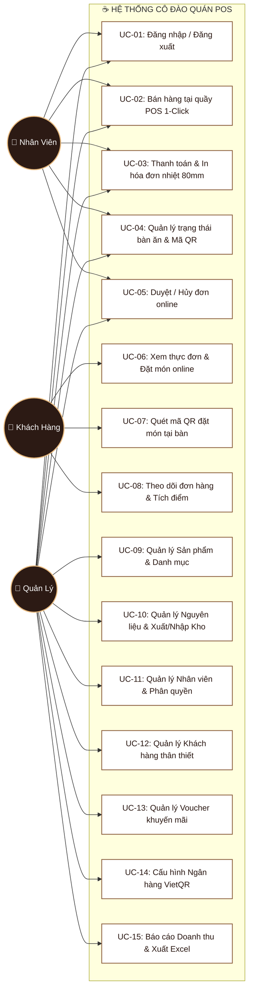
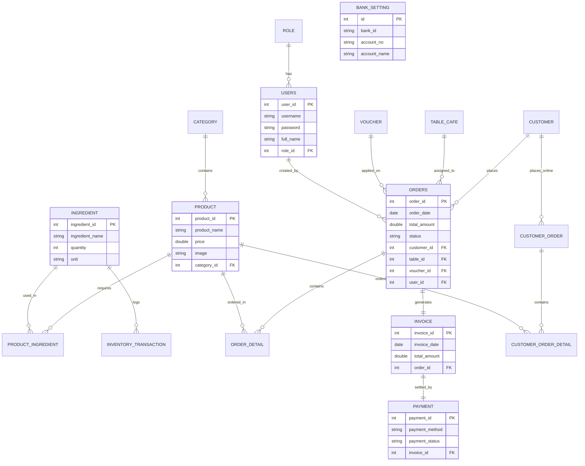
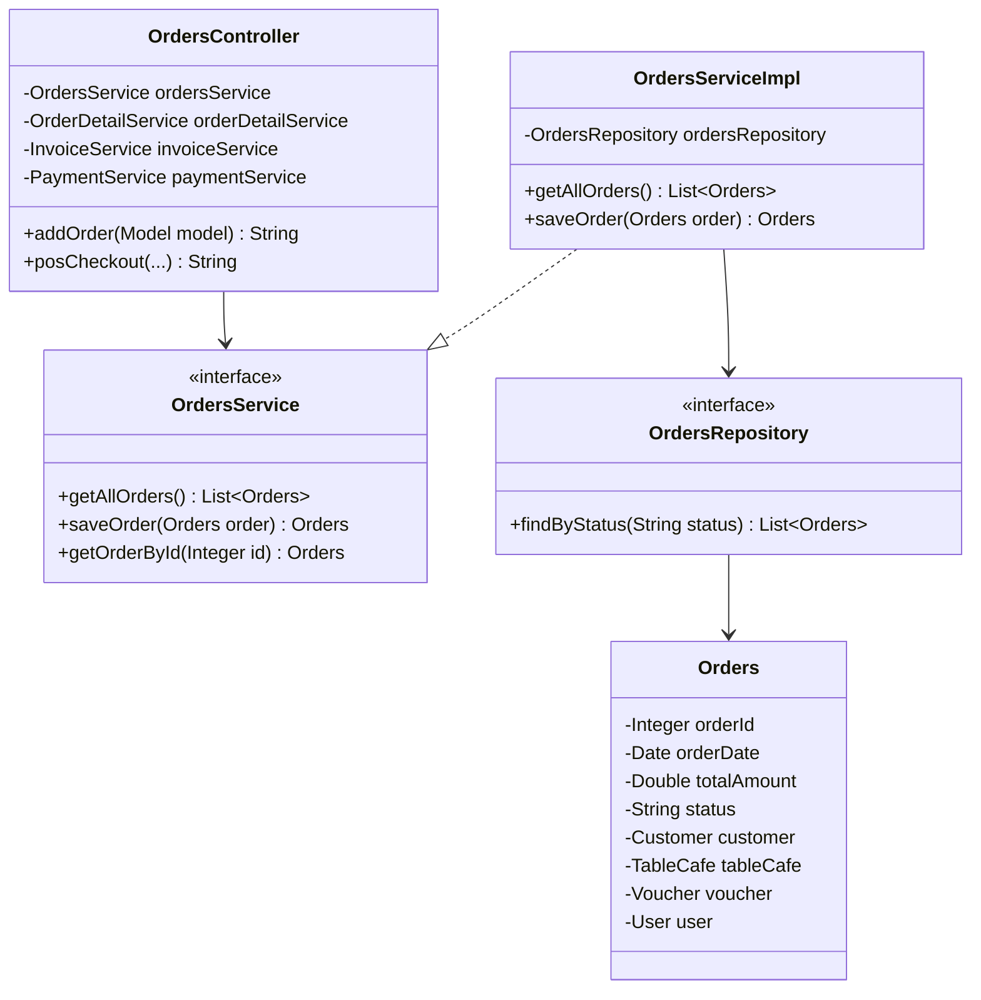
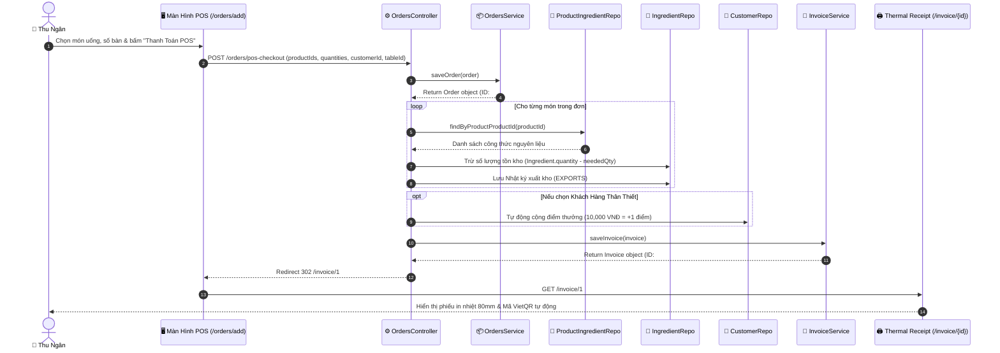
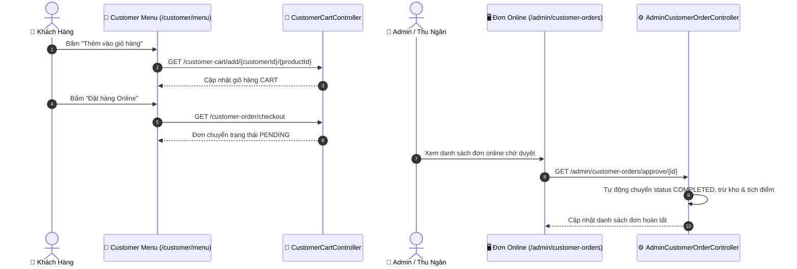
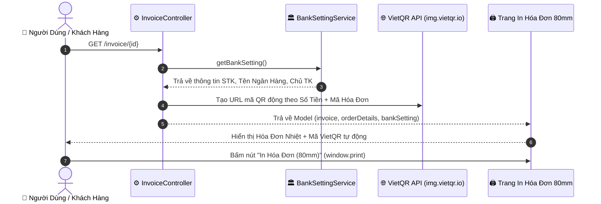
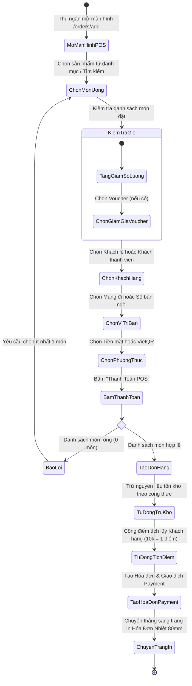
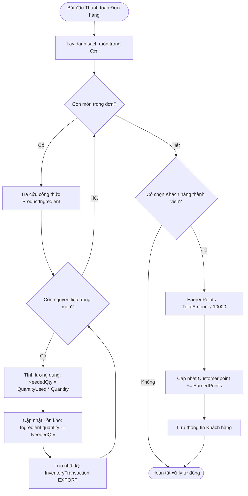
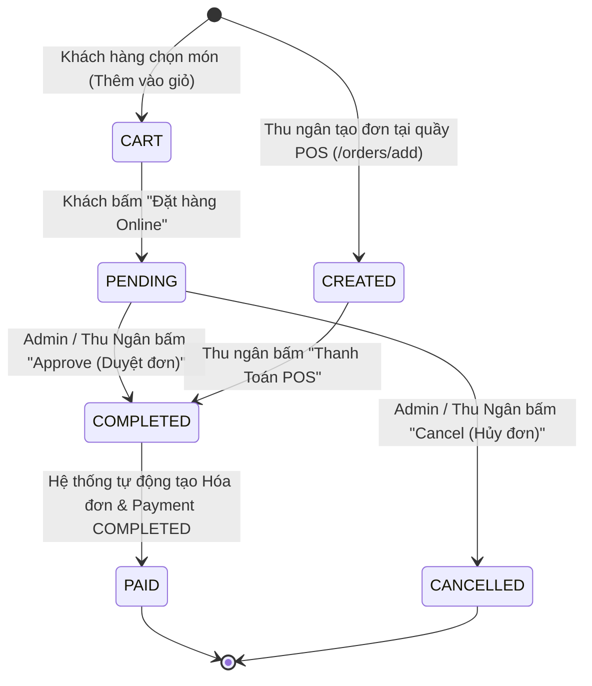
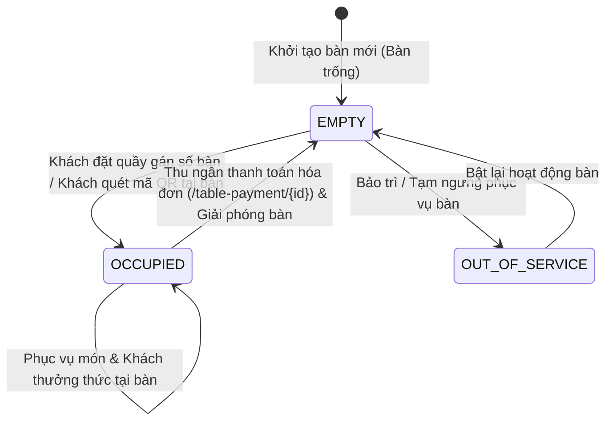

# TỔNG HỢP 10 SƠ ĐỒ UML & THIẾT KẾ HỆ THỐNG CHI TIẾT - CÔ ĐÀO QUÁN POS

Tài liệu này bao gồm **10 sơ đồ UML chuẩn hóa** (Use Case, ERD, Class, Sequence, Activity, State Machine) có kèm mã **Mermaid Diagram** trực quan, giúp bạn sao chép trực tiếp vào báo cáo đồ án, luận văn hoặc công cụ vẽ sơ đồ (Draw.io, StarUML, Mermaid Live Editor).

---

## 📋 DANH SÁCH 10 SƠ ĐỒ TRONG TÀI LIỆU

1. **Sơ đồ 1**: Sơ đồ Use Case Tổng Thể (Overall Use Case Diagram)
2. **Sơ đồ 2**: Sơ đồ Thực Thể Mối Quan Hệ ERD (Full ERD Diagram - 17 Entities)
3. **Sơ đồ 3**: Sơ đồ Lớp Kiến Trúc 3 Tầng (Class Diagram - 3-Tier Architecture)
4. **Sơ đồ 4**: Sơ đồ Tuần Tự - Luồng Bán Hàng Tại Quầy POS (Sequence Diagram - POS Counter Checkout)
5. **Sơ đồ 5**: Sơ đồ Tuần Tự - Luồng Đặt Món Online & Admin Duyệt (Sequence Diagram - Online Order)
6. **Sơ đồ 6**: Sơ đồ Tuần Tự - Luồng Thanh Toán Mã VietQR & In Hóa Đơn Nhiệt 80mm (Sequence Diagram - VietQR & Print)
7. **Sơ đồ 7**: Sơ đồ Hoạt Động - Luồng Xử Lý Bán Hàng POS Thu Ngân (Activity Diagram - POS Order Flow)
8. **Sơ đồ 8**: Sơ đồ Hoạt Động - Luồng Tự Động Trừ Kho Nguyên Liệu & Tích Điểm (Activity Diagram - Auto Recipe Stock & Loyalty Points)
9. **Sơ đồ 9**: Sơ đồ Trạng Thái Vòng Đời Đơn Hàng (State Machine Diagram - Order Status Lifecycle)
10. **Sơ đồ 10**: Sơ đồ Trạng Thái Quản Lý Bàn Ăn (State Machine Diagram - Table Cafe Status Lifecycle)

---

## 📌 CHI TIẾT VẼ & MÃ MERMAID CHO TỪNG SƠ ĐỒ

---

### 1️⃣ SƠ ĐỒ USE CASE TỔNG THỂ (OVERALL USE CASE DIAGRAM)

* **Tác nhân (Actors)**:
  - `Admin (Quản lý)`: Quyền quản trị cao nhất.
  - `Staff (Nhân viên / Thu ngân)`: Thực hiện bán hàng tại quầy và quản lý đơn.
  - `Customer (Khách hàng)`: Đặt món online, quét QR tại bàn, xem lịch sử đơn & tích điểm.

#### Mã sơ đồ Mermaid:

---

### 2️⃣ SƠ ĐỒ THỰC THỂ MỐI QUAN HỆ ERD (FULL ERD DIAGRAM)

Mô tả 17 thực thể CSDL với các khóa chính, khóa ngoại và quan hệ bản thể (Cardinality).

#### Mã sơ đồ Mermaid:

---

### 3️⃣ SƠ ĐỒ LỚP KIẾN TRÚC 3 TẦNG (CLASS DIAGRAM - 3-TIER ARCHITECTURE)

Mô tả sự kết nối giữa các lớp Controller, Service, Repository và Entity trong Spring Boot.

#### Mã sơ đồ Mermaid:

---

### 4️⃣ SƠ ĐỒ TUẦN TỰ - LUỒNG BÁN HÀNG TẠI QUẦY POS (POS COUNTER CHECKOUT)

Mô tả chi tiết tương tác giữa các đối tượng khi thu ngân tạo đơn và bấm **"Thanh Toán & In Hóa Đơn POS"**.

#### Mã sơ đồ Mermaid:

---

### 5️⃣ SƠ ĐỒ TUẦN TỰ - LUỒNG ĐẶT MÓN ONLINE & ADMIN DUYỆT (ONLINE ORDER)

#### Mã sơ đồ Mermaid:

---

### 6️⃣ SƠ ĐỒ TUẦN TỰ - LUỒNG VIETQR & IN HÓA ĐƠN 80MM

#### Mã sơ đồ Mermaid:

---

### 7️⃣ SƠ ĐỒ HOẠT ĐỘNG - LUỒNG XỬ LÝ BÁN HÀNG POS THU NGÂN (ACTIVITY DIAGRAM - POS)

#### Mã sơ đồ Mermaid:

---

### 8️⃣ SƠ ĐỒ HOẠT ĐỘNG - LUỒNG TỰ ĐỘNG TRỪ KHO NGUYÊN LIỆU & TÍCH ĐIỂM

#### Mã sơ đồ Mermaid:

---

### 9️⃣ SƠ ĐỒ TRẠNG THÁI VÒNG ĐỜI ĐƠN HÀNG (STATE MACHINE DIAGRAM - ORDER)

Vòng đời chuyển trạng thái của một đơn hàng trong hệ thống.

#### Mã sơ đồ Mermaid:

---

### 🔟 SƠ ĐỒ TRẠNG THÁI QUẢN LÝ BÀN ĂN (STATE MACHINE DIAGRAM - TABLE CAFE)

Vòng đời chuyển trạng thái của các bàn trong quán trà sữa (`TableCafe`).

#### Mã sơ đồ Mermaid:

